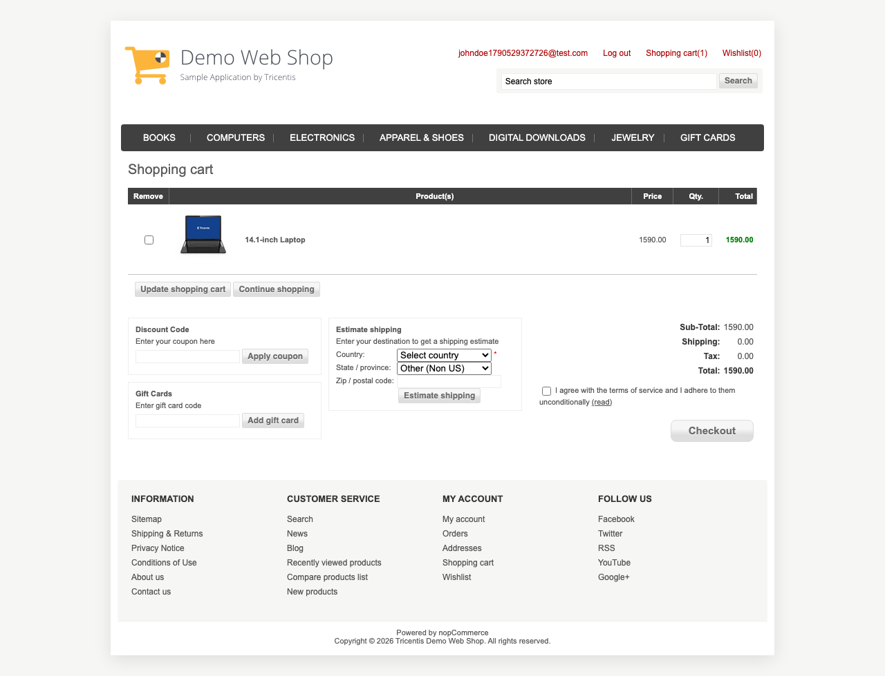
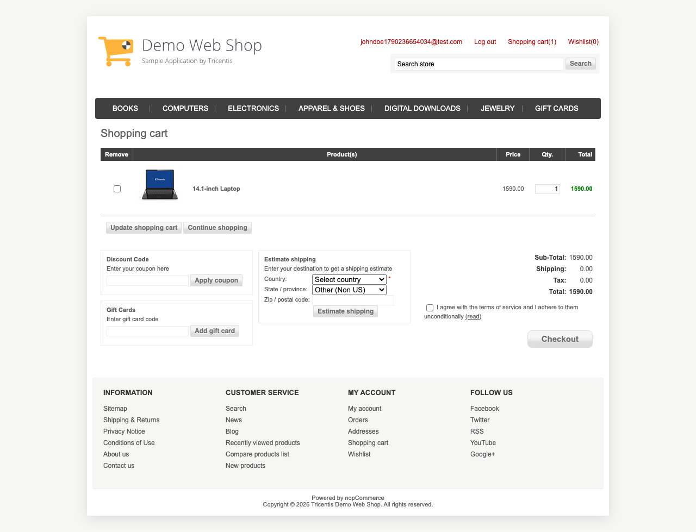
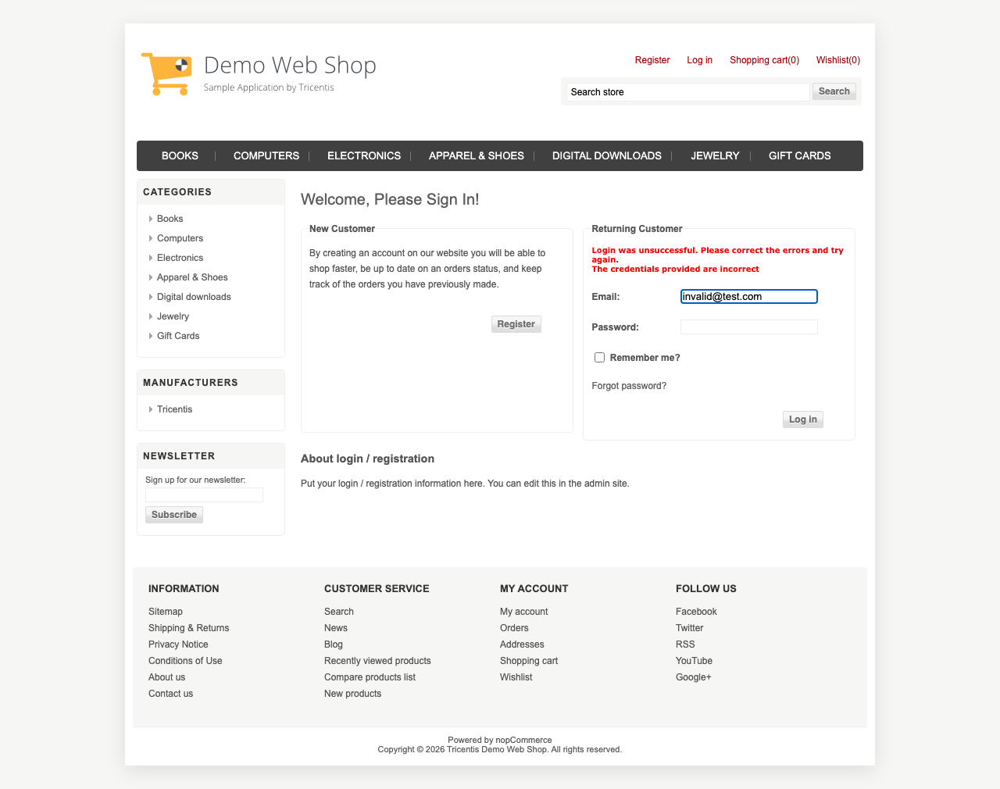

# Demo Web Shop + API Testing Project

This is my SQA project for the Demo Web Shop website and JSONPlaceholder API. It has two parts - UI tests using Playwright with Page Object Model, and API tests using Postman + Newman.

## What is in here

| Part | What | Marks |
|------|------|-------|
| A | UI tests (Playwright + POM) | 50 |
| B | GitHub workflow | 20 |
| C | API tests (Postman + Newman) | 30 |

## Tools I used

- Playwright (JavaScript) for UI testing
- Page Object Model pattern
- Allure + Playwright HTML for reports
- Postman + Newman for API testing
- Node.js v18+
- Java 17+ (needed for Allure)
- Git + GitHub

## Folder layout

    ostad-project-2/
    ├── api-tests/
    │   ├── DemoWebShop_API_Collection.json
    │   └── environment.json
    ├── ui-tests/
    │   ├── fixtures/testData.json
    │   ├── pages/
    │   │   ├── CartPage.js
    │   │   ├── CheckoutPage.js
    │   │   ├── LoginPage.js
    │   │   ├── ProductPage.js
    │   │   ├── RegisterPage.js
    │   │   └── SearchPage.js
    │   ├── tests/
    │   │   ├── q1-invalid-login.spec.js
    │   │   ├── q2-register-add-cart.spec.js
    │   │   └── q3-e2e-checkout.spec.js
    │   ├── package.json
    │   └── playwright.config.js
    ├── reports/
    ├── package.json
    ├── .gitignore
    └── README.md

## Before you start

You need these installed:
- Node.js v18+
- Java 17+ (for Allure CLI)
- Git

Check them with:
    node --version
    npm --version
    java --version
    git --version

## Setup

Clone the repo and install stuff:

    git clone https://github.com/Atef123Ahabab/ostad-project-2.git
    cd ostad-project-2
    npm install
    cd ui-tests
    npm install
    npx playwright install chromium
    cd ..
    npx allure --version
    npx newman --version

## Running the tests

### UI tests

Go into ui-tests folder first:
    cd ui-tests

Run one test at a time:
    npm run test:q1
    npm run test:q2
    npm run test:q3

Run all three in a row:
    npm test

The config has workers set to 1 and fullyParallel set to false, so they run one after another.

### API tests

From the project root:
    npx newman run api-tests/DemoWebShop_API_Collection.json -e api-tests/environment.json -r cli,htmlextra --reporter-htmlextra-export reports/newman-report.html

Should show 10/10 assertions passing across GET /users and PUT /users/{id}.

## Reports

### Allure report

    cd ui-tests
    npm run test:allure
    npm run report:allure

Runs tests, saves results, generates HTML at reports/allure-report/, opens in browser. Each test attaches a full page screenshot.

### Playwright HTML report

    cd ui-tests
    npm run report:html

### Newman HTML report

The Newman command above creates it. Open with:
    open reports/newman-report.html

## What each test does

### Q1 - Invalid login
1. Go to /login
2. Enter wrong email and password
3. Check error message says "Login was unsuccessful"
4. Check user is not logged in

### Q2 - Register and add to cart
1. Register a new user
2. Check success message
3. Log in
4. Search for "14.1-inch Laptop"
5. Open the product
6. Add 1 to cart
7. Check cart shows right product and quantity

### Q3 - Full checkout flow
1. Register and log in
2. Search for "14.1-inch Laptop"
3. Set quantity to 2 and add to cart
4. Check terms checkbox and hit Checkout
5. Fill billing address (US, Alabama)
6. Click Continue through all checkout steps
7. Check order processed message
8. Open order details and check order number

### API tests

GET /users:
- Returns 200
- Response is a non-empty array
- Each user has id, name, email
- Save first users id and phone

PUT /users/{id}:
- Returns 200
- Returned id matches what we saved
- Phone is not empty
- Name matches what we sent
- Email matches what we sent
- Company name matches what we sent

## Branches

| Branch | Whats in it |
|--------|-------------|
| main | Everything merged |
| feature/q1-invalid-login | Q1 test + LoginPage |
| feature/q2-register-add-cart | Q2 test + Register/Search/Product/Cart pages |
| feature/q3-e2e-checkout | Q3 test + CheckoutPage |
| feature/api-automation | Postman collection + environment |

## Repo link

https://github.com/Atef123Ahabab/ostad-project-2

## Author

Atef Ahabab - SQA 19

## Screenshots

Below are sample screenshots from a recent test run. You can also see them in the Allure report after running `npm run test:allure`.

### Q1 - Invalid Login

### Q2 - Cart Verification

### Q3 - Order Confirmation

